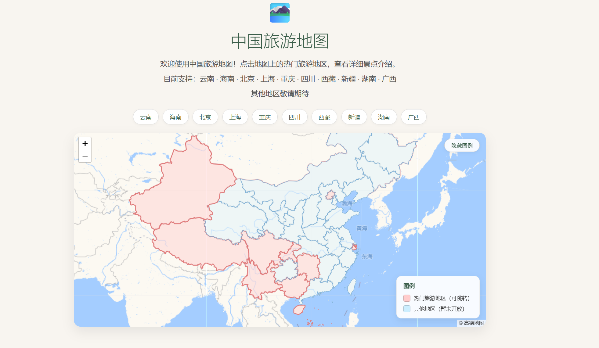

# FinalProject — 中国旅游地图（China Travel Map）

由 湖南师范大学（HNNU）计算机科学与技术（普高师范）专业 — wchopstick 创建

## 简介
这是一个纯前端的交互式中国旅游地图项目（FinalProject）。无需后端服务器，直接在浏览器中打开即可使用。用户可探索 10 个省/直辖市的热门景点，[...] 

网站（GitHub Pages）：[https://wchopstick.github.io/My-Web-Project/](https://wchopstick.github.io/My-Web-Project/)

## 项目结构（概要）

```
FinalProject/
├── index.html                     # 入口，自动跳转到 FinalProject.html
├── FinalProject.html              # 主页面（地图页）
├── FinalProject.css               # 主页面样式
├── FinalProject.js                # 地图交互逻辑（Leaflet）
├── lib/
│   ├── leaflet.js / leaflet.css   # Leaflet 地图库（高德瓦片）
│   └── swiper-bundle.min.js/css   # Swiper 轮播库（景点页用）
├── data/
│   ├── 行政区划.geojson           # 中国行政区划 GeoJSON 数据
│   ├── 中华人民共和国.svg         # SVG 备用素材
│   ├── Welcome Home, Son.mp3      # 音频素材
│   └── images/                    # 各地景点图片（约 100 张）
│       ├── beijing/  (9 张)       ├── guangxi/  (9 张)   ├── sichuan/  (11 张)
│       ├── shanghai/ (9 张)       ├── hainan/   (9 张)   ├── xinjiang/ (9 张)
│       ├── chongqing/(9 张)       ├── hunan/    (9 张)   ├── xizang/   (10 张)
│       └── yunnan/   (9 张)
└── spots/                         # 10 个省市详情页（每个为独立 HTML）
    ├── beijing.html               ├── chongqing.html  ├── sichuan.html
    ├── shanghai.html              ├── guangxi.html    ├── xinjiang.html
    ├── hunan.html                 ├── hainan.html     ├── xizang.html
    └── yunnan.html
```

## 技术栈
- 地图：Leaflet.js（使用高德地图瓦片）
- 轮播：Swiper.js
- 数据：GeoJSON（行政区划）
- 样式：原生 CSS（使用 CSS 变量、Flexbox/Grid）

## 主要功能
- 显示中国地图并绘制省级边界（基于 GeoJSON）
- 支持 10 个地区的高亮与跳转至详情页
- 地图交互：悬停高亮、Tooltip、Popup
- 景点详情页：轮播图、旅行锦囊、景点卡片网格

## 使用说明
1. 克隆仓库：

   ```bash
   git clone https://github.com/wchopstick/My-Web-Project.git
   ```

2. 在本地打开：
   - 直接用浏览器打开 `FinalProject/index.html` 或 `FinalProject/FinalProject.html`。

## 截图




---

创建者：HNNU 湖南师范大学 — 计算机科学与技术（普高师范）专业 — wchopstick
